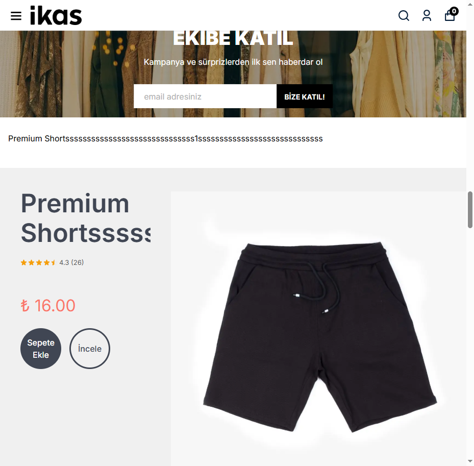

# Bug - Listing Badge Stars Missing On Direct Load

## Status
Fixed — 2026-05-17. Root cause confirmed and fixed; verified on the dev store
(`dev-mertcopper.ikas.shop`) with cold direct entry to home and category pages.

## Area
Storefront widget, listing/category/home/search product cards, listing rating badges.

## Symptom
On direct (cold) entry to home, category, search, or similar listing pages, the
listing badge rendered only the average rating and review count (e.g. `4.3 (26)`)
**without star icons**. After navigating into a product detail page and back, the
stars rendered correctly.

## Root Cause (confirmed 2026-05-17)
The listing badge stars are built by `partialStarsHTML` ([helpers.js](src/widget/core/helpers.js))
as `.ikr-star` / `.ikr-stars-partial` spans wrapping inline SVGs. Each `.ikr-star`
span carries an inline `width:13px;height:13px`, but a `` is `display:inline`
by default — inline elements **ignore** `width`/`height`. The rule that makes the
span `display:inline-flex` (so the size applies) lived **only** inside the
`#ikr-styles` stylesheet.

`#ikr-styles` is injected by `injectStyles()` ([helpers.js](src/widget/core/helpers.js)),
which was called from exactly **one** place: `render.js:335` — the PDP review-block
render path. The listing badge path (`renderListingBadges` → `injectBadges` →
`createBadgeEl`) never injected it.

Result: cold listing entry (no PDP rendered) → `#ikr-styles` absent → `.ikr-star`
stays `display:inline` → inline width/height ignored → star SVGs collapse to
**0×0** → only the `avg (count)` text is visible. Visiting a PDP runs `render.js`,
which injects `#ikr-styles` into `<head>`; it then persists for the SPA session,
so returning to a listing page shows stars.

Confirmed live: cold home / `/shorts` / `/search` / `/clothing` all showed
`.ikr-star` computed `display:inline` and `getBoundingClientRect()` `0×0`.
Temporarily injecting the missing rules made the same stars `13×13`.

Visual evidence:
- Before fix: 
- After fix: 

**Not a Phase 1 (ADR_0013) regression.** Commit `a68704e` did not touch
`render.js`, `badge.js`, `helpers.js`, or `listing-badges/*`. The coupling of the
star CSS to the PDP render path predates Phase 1.

## Fix
The listing badge factory now owns its own star styling, independent of the PDP
render path — no page-type detection, no init-order dependency, no observer
band-aid.

- [helpers.js](src/widget/core/helpers.js) — the partial-stars CSS block
  (`.ikr-stars-partial` / `.ikr-star*`) is extracted into a single exported
  constant `PARTIAL_STARS_CSS`, next to `partialStarsHTML` (matched HTML+CSS pair,
  one source of truth).
- [themes/ozy/styles.js](src/widget/themes/ozy/styles.js) — `CLASSIC_CSS`
  interpolates `${PARTIAL_STARS_CSS}` where the block used to be inline; the PDP
  `#ikr-styles` output is unchanged.
- [badge.js](src/widget/core/badge.js) — new idempotent `ensureBadgeStyles()`
  injects `<style id="ikr-badge-styles">` (≈1.4 KB, the star CSS only) once;
  `createBadgeEl()` calls it. Mirrors the existing `ensureBaseReset()` pattern.

Because both `CLASSIC_CSS` and the badge stylesheet consume the same
`PARTIAL_STARS_CSS` constant, the two copies cannot drift. `#ikr-badge-styles`
and `#ikr-styles` carry identical `.ikr-star` rules and coexist harmlessly on a PDP.
Requires `pnpm build:widget` to land in `public/widget.js`.

## Verification (2026-05-17, dev store, post-fix build)
- Cold home entry (no PDP visited): `#ikr-badge-styles` present, `#ikr-styles`
  absent, `.ikr-star` `display:flex`, size `13×13`, half-star `clip-path` applied.
- Cold category `/shorts` (no PDP visited): same — stars render `13×13`.
- PDP: `#ikr-styles` still injected with star rules; rating badge stars `16×16`;
  JSON-LD / `.ikr-summary` / `.ikr-title` each count 1 (no double render); no
  console errors. No regression from the `helpers.js` / `styles.js` change.

## Related Source Files
- [src/widget/core/badge.js](src/widget/core/badge.js)
- [src/widget/core/helpers.js](src/widget/core/helpers.js)
- [src/widget/themes/ozy/styles.js](src/widget/themes/ozy/styles.js)
- [src/widget/product-widget/render.js](src/widget/product-widget/render.js)
- [src/widget/listing-badges/index.js](src/widget/listing-badges/index.js)

## Obsidian Links
- [[Bug_Index]]
- [[Listing_Rating_Widget]]
- [[ADR_0013_Modular_Widget_Loader_Architecture]]
- [[Ikas_Storefront_Events]]
- [[Phase_1_Widget_Runtime_Audit]]
